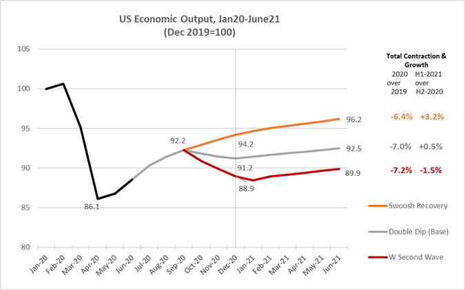

# Introduction {#intro}

```{r setup1, include=FALSE}
knitr::opts_chunk$set(fig.align='center')
```

This chapter is designed to motivate the use of statistics - basically because we are constantly bombarded with statistics on a daily basis. We will start with some motivating examples and an introduction to some important terminology and equations used to calculate descriptive measures (e.g., mean, standard deviation, etc.). This chapter will start throwing around some data and some R code in the applications, but we formally get into these code details later. You should skim over those details at first and focus on the results and conclusions provided. You can always come back to this chapter and focus on replicating the code once we cover those details in later chapters.

## The "Big Picture" of Statistics
   
**Question 1:**

A wholesaler has an inventory of 100,000 light bulbs and wants to market them. What can be said about the lifespan of the light bulbs in this inventory?

```{r, echo = FALSE, fig.align='center', out.width="50%", fig.cap = "How do we know so much about this unused lightbulb?"}
library(knitr)
library(jpeg)
include_graphics("images/BULB.jpg")
```

---

**Question 2:**

An economist wants to forecast the future state of output in the economy. What variables (i.e., leading indicators) should be included in her model? How much confidence should we place in her predictions?

```{r, echo = FALSE, fig.align='center', out.width="80%", fig.cap = "The Dismal Science"}
library(png)

```


---

**Question 3:**

A meteorologist wants to predict the path of a hurricane. This is a forecasting model - very similar to the economists problem. How confident can we be in her predicted path of the storm?

```{r, echo = FALSE, fig.align='center', out.width="70%", fig.cap = "The _Cone of Uncertainty_"}

```

---

These and many more relevant questions can be answered (as best as possible) using **statistics**.

> **Statistics** is the branch of mathematics that transforms data into useful information for decision makers. Statistics are used to summarize data, draw conclusions, make forecasts, and make better sense of the world and the decisions we make within it.

Statistics is broken into two related branches. 

> **Descriptive statistics** are used to summarize, analyze, and present data. Since the values of a dataset are in hand (i.e., observable), the descriptive statistics of a dataset are *facts*. 

> **Inferential statistics** use the descriptive statistics from the data to draw conclusions about a larger group of observations that at the moment are *impossible* (or too expensive) to observe. Since this larger group of data is not in hand, the inferential statistics that stem from an analysis are *predictions*.

---

## The Vocabulary of Statistics

* A **variable** is a characteristic of an item or group that one wishes to analyze.
   
* **Data** are the different values of the variable observed and recorded.
   
* An **operational definition** establishes a meaningful use of the variable. Simply put, we need to ensure the data sufficiently captures what you want to analyze.
   
* A **population** consists of all items you want to draw a conclusion from. The issue with a population is that it is the entire universe of observations that you are interested in, but they can never be fully observed. 

   + Sometimes a population is too costly to collect and analyze. For example, you won't call up every single voter for an election poll. 
   
   + Sometimes a population is impossible to collect because some observations have yet to be determined. For example, the population of end-of-day indices for the S&P 500 includes every observation that has ever existed as well as every observation **that has yet to exist**.

* A **sample** is the portion (i.e., subset) of a population selected for analysis. These are our observations in hand.

* A **statistic** is a characteristic of a sample. Since we can observe the sample (i.e., our dataset), these are our descriptive statistics.

* A **Parameter** is a characteristic of a population. Since we cannot observe the population, the best we can do is draw inferential statistics (or predictions) around them. While the value of a parameter exists, we would have to be omniscient in order to know it. The best we can do is use our sample statistics to construct an *educated guess* of what this value might be.

Recall the problem of the wholesaler who has a supply of light bulbs. It would be great if we could state what the *average lifespan* of the light bulbs are, but that would require timing every light bulb until they burn out. This isn't very useful. 

The seven terms stated above translate to our light bulb example as follows:

Term                     | Our light bulb problem
-------------------------|-----------------
Variable                 | The lifespan of a light bulb   
Data                     | The light bulbs that you actually plugged in and recorded the time it takes until burnt out   
Operational Definition   | The lifespan *in minutes*
Population               | The entire group of light bulbs (all 100,000 of them)
Sample                   | The subset of the population selected for analysis. Sometimes referred to as the *data sample*.
Statistic               | The average lifespan of every light bulb **in the sample**
Parameter               | The average lifespan of every light bulb **in the population**

Inferential statistics allow us to describe the parameter of a population by using the corresponding statistic of a sample. We will **never** be able to truly know the population parameter, because the information available in the sample is all we got.

How do we know if the sample statistic is a GOOD predictor of the population parameter? The kicker is that since we cannot observe the population, the only thing we can do is try our best to ensure that the characteristics of the sample are the same as the population. This has to do with sample selection - a very important topic that will be addressed soon. First, we start by discussing the descriptive measures of data.

---

## Descriptive Measures

This section summarizes the measures we use to describe data samples.

* **Central Tendency**: the central value of a data set

* **Variation**: the dispersion (scattering) around a central value

* **Shape**: the distribution pattern of the data values

These measures will be used repeatedly in our analyses, and will affect how confident we are in our conclusions. 

To introduce you to some numerical results in R, we will continue with our light bulb scenario and add some actual data. Suppose we sampled 60 light bulbs from our population, turned them on, and timed each one until it burned out. If we recorded the lifetime of each light bulb, then we have a dataset (or data sample) of 60 observations on the lifetimes of light bulbs. This is what we will be using below.

---

### Central Tendency

The **Arithmetic** or **sample mean** is the average value of a variable within the sample.

$$\bar{X}=\frac{\text{Sum of values}}{\text{Number of observations}}=\frac{1}{n} \sum\limits_{i=1}^n X_i$$

```{r}
# the mean of our lightbulb sample:
# First we load the data set and this will give us 60 observations of the lifespan of each of our 60 light bulbs in the sample. The variable is called "Lifetime" - which can be observed by using the "list" command.

load("data/Lightbulb.Rdata")
list(Lifetime)

(mean(Lifetime))
```
The average lifetime of our 60 $(n=60)$ observed light bulbs is 908 hours.

---

The **median** is the middle value of an ordered data set.

* If there is an odd number of values in a data set, the median is the middle value

* If there an even number, median is the average of the two middle values

```{r}
# the median of our lightbulb sample:
(median(Lifetime))
```

The median lifetime of our 60 observed light bulbs is 902 hours.

---

The **mode** is the most frequently appearing value in a set of observations. The mode might not exist if there is a set of unique, non-repeating observations.

```{r}
# There isn't a built in function for the mode in R... but we can create one.

Mode <- function(x) {
  ux <- unique(x)
  ux[which.max(tabulate(match(x, ux)))]
}

(Mode(Lifetime))
```
The most commonly observed lifetime of our 60 observed light bulbs is 859 hours. Note that this doesn't say anything really about how many times this value has been observed, just that it has been observed more than any other value. We will not be using this measure as much as the previous two.

---

**Percentiles** break the ordered values of a sample into proportions.

* Quartiles split the data into 4 equal parts

* Deciles split the data into 10 equal parts

* In general, $(p * 100)^{th}=p(n+1)$

A percentile delivers an observed value such that a determined proportion of observations are less than or equal to that value. You can choose any percentile value you wish. For example, the code below calculates the 4th, 40th, and 80th percentiles of our light bulb sample.


```{r}
# You can generate any percentile (e.g. the 4th, 40th, and 80th) using the quantile function:
(quantile(Lifetime,c(0.04, 0.40, 0.80)))
```

This result states that 4% of our observations are less that 788 hours, 40% of our observations are less than 889 hours, and 80% of our observations are less than 966 hours. Note that the median (being the middle-ranked observation) is by default the 50th percentile.

```{r}
(quantile(Lifetime,0.50))
```

---

The main items of central tendency can be laid out in a Five-Number Summary:

* Minimum
* First Quartile (25th percentile)
* Second Quartile (median)
* Third Quartile (75th percentile)
* Maximum

```{r}
summary(Lifetime)
```

---

### Variation

The **sample variance** measures the average (squared) amount of dispersion each individual observation has around the sample mean. This is a very important measure in statistics, so take some time to understand exactly what this equation is actually calculating. In particular, $X$ is a variable and $X_i$ is an arbitrary single observation from that group of data. Once the mean $(\bar{X})$ is calculated, $X_i - \bar{X}$ is the difference between a single observation of X and the overall mean of X. Sometimes this difference is negative $(X_i < \bar{X})$ and sometimes this difference is positive $X_i > \bar{X}$ - which is why we need to square these differences before adding them all up. Nonetheless, once we obtain the average value of these differences, we get a sense of the amount of dispersion these individual observations are scattered around the sample average. If this value was zero, then this means that *every* observation of $X$ is equal to $\bar{X}$. The greater the value is from zero, the greater the average dispersion of individual values around the mean.

$$S^2=\frac{1}{n-1}\sum\limits_{i=1}^n(X_i-\bar{X})^2$$

The **sample standard deviation** is the square-root of the variance and measures the average amount of dispersion... this essentially is done to back-out the fact that we had to square the differences of $X_i - \bar{X}$

$$S=\sqrt{S^2}$$

```{r}
(var(Lifetime))
(sd(Lifetime))
```

The variance of our sample of light bulb lifetimes is 6236 squared-hours. After taking the square root of this number, we can conclude that the standard deviation of our sample is 79 hours. Is this standard deviation big or small? The answer to this comes when we get to statistical inference.

#### Discussion

* The term $(X_i-\bar{X})$ is squared because individual observations are either above or below the mean by design. If you don't square the terms (making the negative numbers positive) then they will surely sum to zero.

* The term $(n-1)$ appears in the denominator because this is a *sample* variance and not a *population* variance. In a population variance equation, the term gets replaced with $n$ because we know the population mean. Since we had to estimate the population mean (i.e. used the sample mean), we had to deduct one **degree of freedom**. We will talk more about degrees of freedom later, but the rule of thumb is that we deduct a degree of freedom every time we build a sample statistic (like sample variance) using another sample statistic (like sample mean).

---

The **coefficient of variation** is a relative measure which denotes the amount of scatter in the data relative to the mean.

The coefficient of variation is useful when comparing data on variables measured in different units or scales (because the CV reduces everything to percentages).

$$CV=\frac{S}{\bar{X}}*100\%$$

Take for example the Gross Domestic Product (i.e., output) for the states of California and Delaware.

```{r}
library(readxl)
CARGSP <- read_excel("data/CARGSP.xls")
DENGSP <- read_excel("data/DENGSP.xls")

CGDP <- CARGSP$CGDP
DGDP <- DENGSP$DGDP

(mean(CGDP))
(sd(CGDP))

(mean(DGDP))
(sd(DGDP))
```

A quick analysis of the real annual output observations from these two states between the years 1997 and 2020 suggest that the average annual output of California is 2,094,764 million dollars (with a standard deviation of 397,104 million) and that of Delaware is 56,997 million dollars with a standard deviation of 12,396 million). These two states have lots of differences between them, and it is difficult to tell which state has more volatility in their output. 

If we construct coefficients of variation:

```{r}
(sd(CGDP)/mean(CGDP))*100

(sd(DGDP)/mean(DGDP))*100
```

We can now conclude that Delaware's standard deviation of output is almost 22% that of its' average output, while California's standard deviation is 19%. This would suggest that Delaware has the more volatile output, relatively speaking.

---

### Measures of shape

Comparing the mean and median of a sample will inform us of the skewness of the distribution.

* mean = median: a *symmetric* or *zero-skewed* distribution.

```{r, echo=FALSE}
 N <- 10000
 x <- rbeta(N, 5, 5)
 hist(x, probability = T,
   col='lightblue', xlab=' ', ylab=' ', axes=F,
   main='Symmetric')
lines(sort(x),dbeta(sort(x),5,5), col='red', lwd=3)
```

* mean > median: a *positive-skewed* or *right-skewed* distribution 
    + the right-tail is pulled in the positive direction
 

```{r, echo=FALSE}
 N <- 10000
 x <- rbeta(N, 2, 5)
 hist(x, probability = T,
   col='lightblue', xlab=' ', ylab=' ', axes=F,
   main='Positive Skewed')
lines(sort(x),dbeta(sort(x),2,5), col='red', lwd=3)
```


 
* mean < median: a *negative-skewed* or a *left-skewed* distribution
    + the left-tail is pulled in the negative direction
 
```{r, echo=FALSE}
 N <- 10000
 x <- rbeta(N, 5, 2)
 hist(x, probability = T,
   col='lightblue', xlab=' ', ylab=' ', axes=F,
   main='Negative Skewed')
lines(sort(x),dbeta(sort(x),5,2), col='red', lwd=3) 
```

The degree of skewness is indicative of outliers (extreme high or low values) which change the shape of a distribution.


### Covariance and Correlation

While we won't be examining relationships between different variables until later on in the course, we can easily calculate and visualize these relationships.

The **covariance** measures the strength of the relationship between two variables. This measure is similar to a variance, but it can be either positive or negative depending on how the two variables move in relation to each other.

$$cov(X,Y)=\frac{1}{n-1}\sum\limits_{i=1}^n(X_i-\bar{X})(Y_i-\bar{Y})$$

The **coefficient of correlation** transforms the covariance into a relative measure

$$corr(X,Y)=\frac{cov(X,Y)}{S_{X}S_{Y}}$$
The correlation transformed the covariance relationship into a measure between -1 and 1

* $corr(X,Y)=0$: There is no relationship between $X$ and $Y$

* $corr(X,Y)>0$: There is a positive relationship between $X$ and $Y$ - meaning that the two variables tend to move in the same direction

* $corr(X,Y)<0$: There is a negative relationship between $X$ and $Y$ - meaning that the two variables tend to move in the opposite direction

#### Extended Example:

These notes are concluded with a summary of all of the descriptive measures we discussed. Consider a dataset that is internal to R (called mtcars) that contains characteristics of 32 different automobiles. We will focus on two variables: the average miles per gallon (mpg) and the weight of the car (in thousands of pounds).

```{r}
car <- mtcars # This loads the dataset and calls it car

# Lets examine mpg first:
summary(car$mpg)
hist(car$mpg,20,col = "yellow")

# Variance:
(var(car$mpg))

# Standard deviation:
(sd(car$mpg))
```

The above analysis indicates the following:

* The sample average MPG in the sample is 20.09, while the median in 19.20. This indicates that there is a slight positive skew to the distribution of observations.

* The lowest MPG is 10.4 while the highest is 33.90.

* The first quartile is 15.43 while the third is 22.80. This delivers the *inter-quartile range* (the middle 50% of the distribution)

* The standard deviation is 6.03 which delivers a 30 percent coefficient of correlation. 

```{r}
## Lets now examine weight:
summary(car$wt)
hist(car$wt,20,col = "pink")

# Variance:
(var(car$wt))

# Standard deviation:
(sd(car$wt))
```

The above analysis indicates the following:

* The sample average weight in the sample is 3.22 thousand pounds, while the median in 3.33. This indicates that there is a slight negative skew to the distribution of observations.

* The lowest weight is 1.51 while the highest is 5.42.

* The first quartile is 2.58 while the third is 3.61.

* The standard deviation is 0.99 which also delivers a 30 percent coefficient of correlation. 

```{r}
# We can now look at the relation between mpg and weight

(cov(car$mpg,car$wt))
(cor(car$mpg,car$wt))

plot(car$mpg,car$wt,
     xlab = "Miles per gallon",
     ylab = "Weight of car",
     main = "A Scatter plot",
     col = "cyan")

```

The negative correlation as well as the obviously negative relationship in the scatter-plot between the weight of a car and its miles per gallon should make intuitive sense - heavy cars are less efficient.

#### The Punchline

Suppose we want to learn about a relationship between a car's weight and its fuel efficiency. Our sample is 32 automobiles, but our population is EVERY automobile (EVER). We would like to say something about the population mean Weight and MPG.

How does the sample variance(s) give us confidence on making statements about the population mean when we're only given the sample? That's where inferential statistics comes in. Before we get into that, we will dig into elements of collecting data (upon which our descriptive statistics are based on) and using R (with which we will calculate our descriptive statistics using our collected data).


