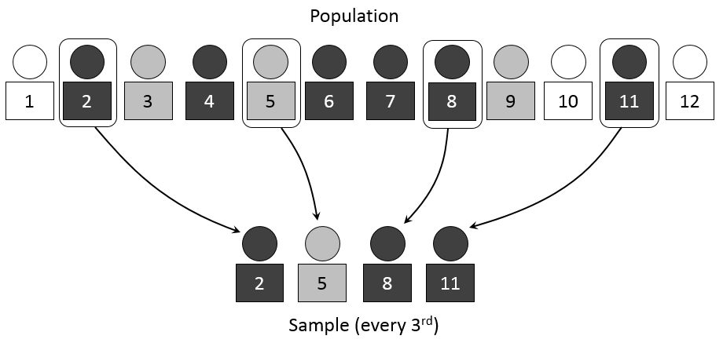

# Data Collection and Sampling {#Data}

```{r, include=FALSE}
knitr::opts_chunk$set(fig.align='center')
```

Always remember the ultimate goal of inferential statistics: We want to say something important about the characteristics (parameters) of a population without ever observing the entire population. Therefore, the best thing we can do is to draw a sample (i.e., subset) from the population and use it to calculate characteristics (statistics) of a sample and draw inference on the population parameters. 

The reason why we can say something about a population parameter of interest solely by looking at the statistics from a sample is because we are under the assumption that *the sample has the same characteristics of the population*. In other words, we say that the sample average is a good guess for the population average, the sample standard deviation is a good guess for the population standard deviation, etc. This is not an assumption that is simply made by wishful thinking. In fact, there is an entire field of statistics devoted to proper *sample selection*. We won't spend a lot of time on this very important matter, but we will discuss a few sampling methods so you can rest assured that our crucial assumption of similar sample and population characteristics has a reasonable chance of holding.


---

## Sampling Distributions

Recall that a **sample** is the subset of a **population** selected for analysis.

We are forced to analyze a sample rather than a population because:

1. selecting a sample is less time-consuming than selecting the population

2. selecting a sample is less costly

3. the resulting analysis is less cumbersome and more practical

4. sometimes obtaining the sample is *impossible*! So the sample is the best we can do.

When making statements on the population parameters using the sample statistics, we are drawing **statistical inference**. In order for this inference to be reasonable, we must assume that the characteristics of the sample (i.e., the sample statistics) are reasonably close to the characteristics of the population (i.e., the population parameters). The problem with this assumption is that since we will never see the population, we will never be able to verify if the statistics are reasonably close to the parameters. This chapter discusses several different methods of drawing a sample from a population, as well as their pros and cons. The bottom line is that all of these methods attempt to get a sample to be the best possible subset of the population.

Failing to obtain a sample with the same characteristics as the population can fatally flaw a statistical analysis. If the sample statistics are not close to the population parameters, you are potentially over-representing and/or under-representing important aspects of the population. When the sample statistics do not coincide with the population parameters, then the statistics are said to be *biased*. When this bias stems from a faulty sample, then this is called **sampling bias**.

## Sampling Bias - two examples

There are quite a few glaring examples of sampling bias in history. One of them has to do with a rather famous photo:

### Dewey Defeats Truman?

```{r, echo = FALSE, fig.align='center', out.width="50%", fig.cap = "Dewey Defeats Truman? (1948)"}
library(knitr)
library(jpeg)

```

After defeating Thomas Dewey with a comfortable margin of 303 electoral college votes to Dewey's 189, President Harry Truman holds up a Chicago Daily Tribune stating the exact opposite. While the Truman Library would like to think that this iconic photo is an example of tenacity, perseverance, self-confidence, and success - it's actually a result of *sampling bias*.

The reporting error stems from the fact that the newspaper conducted a poll using phone numbers obtained from a list of vehicle registrations. Most people didn't have phones in 1948, and the people that were being polled had both phones and automobiles. This skewed the sample distribution to wealthy, white, males - which was obviously not sharing similar views with the overall voting population.

### 98.6?

Everybody knows the following *fact* about their body...

> The average human body temperature is 98.6 degrees F (37 degrees C).

Is it really? To put this issue in the context of our terminology, the *average human body temperature* is a population parameter. The population here is every human that has ever lived and ever will live (i.e., an unobtainable sample). This average is actually a sample average obtained by a German physician in 1851 - a time believed by many current physicians to be one where many suffered from chronic infectious diseases resulting in inflammation and mild fevers. Current studies are suggesting the average human body temperature is more like one degree lower than previously thought.

Now to be clear, there is a bit of a semantic argument about this last example. Some empiricists do not call this necessarily a sampling bias issue in 1851, because if a large portion of the population did regularly suffer from mild fevers then the sample was an accurate subset of the population at the time. Of course, if one is saying that the 1851 estimate of 98.6 degrees F is a representation of the *current* population - then that can be regarded as sampling bias.

## Sampling Methods

The sampling process begins by defining the **frame** - a listing of items that make up the population. A frame could be population lists, maps, directories, etc. For our Truman example above, the frame was incorrectly chosen to be a list of registered vehicle owners (so the poll was doomed from the start).

A sample is drawn from a frame. The sample could be a **nonprobability sample** or a **probability sample**. The items in a nonprobability sample are selected without knowing their probabilities of selection. This is usually done out of convenience (e.g., all voluntary responses to a survey or selecting the top or bottom of a frame). While these samples are quick, convenient, & inexpensive, they most likely suffer from selection bias. We can perform (albeit, incorrectly) statistical analyses on these samples, but we are going to restrict attention to probability samples which are selected based on known probabilities.

### Simple random sampling


```{r, echo = FALSE, fig.align='center', out.width="50%", fig.cap = "Simple Random Sampling"}
include_graphics("images/random.png")
```

In a **simple random sample**, every item in a frame has an equal chance of being selected.

The chance (or probability) of being selected depends on if you're selecting...

* With replacement (1/N chance for all)
* Without replacement (1/N, 1/(N-1), 1/(N-2), ...)

Examples of simple random sampling methods:

* Fishbowl methods
* random number indexing

**Advantages:**

* Simple random sampling is associated with the minimum amount of sampling bias compared to other sampling methods.

* If the sample frame is available, selecting a random sample is very easy.

**Disadvantages:**

* Simple random sampling requires a list of all potential respondents (sampling frame) to be available beforehand - which can be costly.

* The necessity to have a large sample size (i.e., lots of observations) can be a major disadvantage in practical levels

### Systematic Sampling

```{r, echo = FALSE, fig.align='center', out.width="70%", fig.cap = "Systematic Sampling"}

```

A systematic sample begins with partitioning the N items in a frame into n groups of k items

$$k=\frac{N}{n}$$

* randomly select a number from 1 through k

* select the kth member from each of the n groups

For example: Suppose you want a sample n=40 out of N=800.

* Divide the population into k=20 groups.

* Select a number from 1-20 (e.g. 8)

* Sample becomes items 8,28,48,68,88,...

**Advantages**

* it will approximate the results of simple random sampling

* it is cost and time efficient

**Disadvantages**

* it can be applied only if the complete list of a population is available

* the sample will be biased if there are periodic patterns in the frame

### Stratified Sampling

```{r, echo = FALSE, fig.align='center', out.width="50%", fig.cap = "Stratified Sampling"}
include_graphics("images/Stratified.png")
```

A stratified sample divides the N items in the frame into important sub-populations (strata)

* Each strata groups items according to some shared characteristic (gender, education, etc.)

Once these strata are constructed. A researcher selects a simple random sample from each strata and combines.

**Advantages**

* it is superior to simple random sampling because it reduces sampling error and ensures a greater level of representation

* ensures adequate representation of all subgroups

* when there is homogeneity within strata and heterogeneity between strata, the estimates can be as precise (or even more precise) as with the use of simple random sampling

**Disadvantages**

* requires the knowledge of strata membership

* process may take longer and prove to be more expensive due to the extra stage in the sampling procedure

### Cluster Sampling

```{r, echo = FALSE, fig.align='center', out.width="50%", fig.cap = "Cluster Sampling"}
include_graphics("images/Cluster.png")
```

**Cluster Sampling** occurs when you break the sample frame into specific groups (i.e., clusters) and then randomly select several clusters as your sample. An example of this method is the consumer price index (CPI) which is a measure of inflation calculated by the Bureau of Labor Statistics in the U.S. (US BLS). When trying to estimate the overall change in a *basket* of consumption goods across the US, the BLS breaks the US into metropolitan statistical areas (MSAs) and treats each one as a cluster. The BLS then goes and prices the various goods in the clusters selected for analysis.

**Advantages:**

* the most time-efficient and cost-efficient probability design for large geographical areas

* easy to use

* larger sample size can be used due to increased level of accessibility of perspective sample group members
 
**Disadvantages**

* requires group-level information to be known

* commonly has higher sampling error than other sampling techniques

* may fail to reflect the diversity in the sampling frame

---

## Sampling in Practice

The sampling methods above deal with situations in which the population is hypothetically obtainable, but it is not feasible due to time or resource constraints. For example, a company could run a concrete election poll by calling up *every single registered voter* (the population), but that would cost too much and take too long. What happens in the situation where the population is unobtainable, meaning that at any point in time there will be some obtainable portion of the population because it hasn't occurred yet. For example, if I wanted to analyze US unemployment rates, I couldn't possibly consider *future* rates that haven't been observed yet. In situation like these, one must take time to consider exactly what population you want to draw inferences from and draw their sample accordingly.

A quick example of data sampling in my own research is as follows. Some of my research deals with how bank lending responds to changes in the stance of monetary policy.^[Dave, Chetan, Scott J. Dressler, and Lei Zhang, (2013). The bank lending channel: a FAVAR analysis. *Journal of Money, Credit, and Banking* 45(8). 1705-1720.] Since bank lending data is coming in daily, it is clear that the entire population is unobtainable. However, selecting a sample is not simply *collect as many observations as possible* because we must be clear about what population we want to actually talk about. In my example, I want to talk about how bank lending responds to monetary policy shocks *in normal times*. This means that observations in the sample cannot be impacted by episodes where monetary policy differed from what is currently considered normal. This restricts my sample to be after World War 2 and before episodes of unconventional monetary policy (i.e., anything post-2007).

What happens if characteristics of the population potentially changes? That's easy - you repeat the analysis with an updated sample and acknowledge that you are drawing inferences on a potentially different population. That is what I am currently researching. In particular, I am determining how bank lending responds to monetary policy under unconventional monetary policy practices of paying interest on excess reserves. This requires a data sample of observations appearing after 2007.


## Sampling and Sampling Distributions 

This chapter concludes with the hypothetical concept of a sampling distribution. Understanding this concept is crucial to understanding the entire point of inferential statistics.

Recall that we want to make statistical inferences that use statistics calculated from samples to estimate parameters of the population.

Plain statistics draws conclusions about the sample (those are facts) while statistical inference draws conclusions about the population.

In practice, a single sample is all that is selected. In other words, once you construct your sample it is all of the observations you have to use.

Since the actual observations inside your sample were selected at random, then the sample you constructed is in fact a *random* sample.

If the random observations were drawn from a sample frame, what was the resulting random sample drawn from? The answer is a **sampling distribution**.

### An Application

Consider the scenario discussed above where we want to determine the population average human body temperature. At a particular point in time, the population is every human. As the particular points in time change, new births implies that the population is changing as well! Clearly the overall population is unobtainable - so we need to draw a sample. 

Suppose we decide on a sample size of 10,000 adults. Regardless of the sampling method chosen from the list above, we arrive at a data sample of 10,000 observations of human body temperatures. Since these individuals were selected *randomly*, then the sample mean calculated from the *random sample* is itself *random*. If we randomly draw another sample of 10,000 observations, we can get another sample average. We can do this repeatedly, getting a different sample average for every sample randomly drawn. 

Note that this is purely hypothetical because we would never draw numerous samples... but bear with me. 

We have established that our sample was a random draw from our population. Therefore, the sample mean calculated from our random sample is itself a random draw from a sampling distribution. 

Think of a sampling distribution as a histogram showing you the outcomes of all possible sample means and their frequency of appearing. This distribution will have characteristics of its own. The mean of this distribution would be the mean value of all possible sample means. The standard deviation would be the amount of average dispersion all individual sample means around the overall mean. 

What we will soon see is that this sampling distribution will be the foundation to inferential statistics. To see this, we will combine this concept of a sampling distribution with something called the Central Limit Theorem (CLT). The CLT is so important, it deserves its own chapter. However, before we get to that conceptual stuff, we will first get into the practical stuff. Namely, an introduction to the R project for Statistical Computing.


